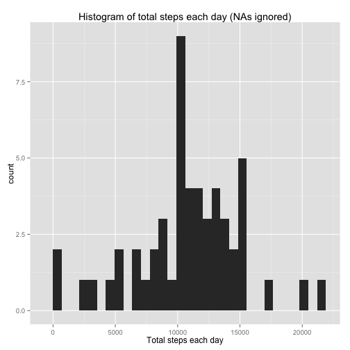
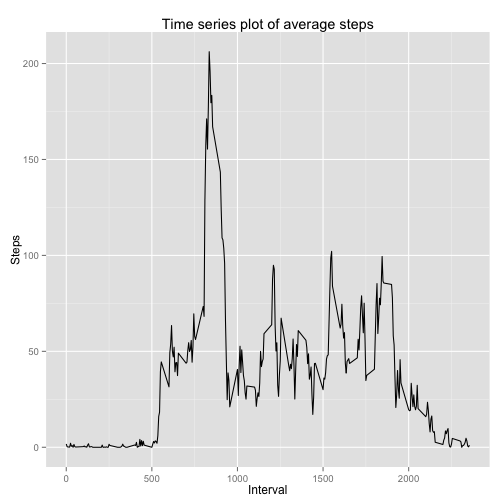
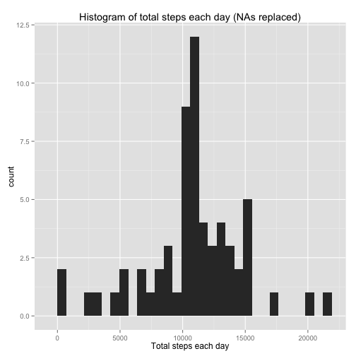
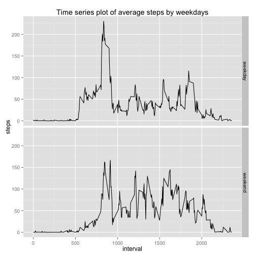

Author: *T.T*  
Date: 2015/08/07

---

## Loading and preprocessing the data
- change the "date" variable to date class

```r
# setwd("/Users/T/Dropbox/Coursera/Data Science S/5 Reproducible Research/assignment 1/RepData_PeerAssessment1") # don't run this code when knit2html("PA1_template.Rmd")
data <- read.csv(unz("activity.zip", "activity.csv"), header = TRUE)
data$date <- as.Date(data$date)
```

- set global option
- use cache for all chunks
- don't use scientific notation

```r
library(knitr)
opts_chunk$set(echo = TRUE, cache = TRUE)
options(scipen = 1)
```

---

## What is mean total number of steps taken per day?

### 1. Calculate the total number of steps taken per day
- NAs are **ignored** (ruled out) in this part, not **replaced** by 0.
- So, the `na.rm` argument should be FALSE.

```r
stepsPerDay_ignore.na <- tapply(data$steps, data$date, sum, na.rm = FALSE) # na.rm = FALSE
```

### 2. Make a histogram of the total number of steps taken each day
- [Here](http://www.shodor.org/interactivate/discussions/HistogramsVsBarGraph/) is an explanation of difference between histogram and barplot.   
- the `binwidth` is defined according to default, to avoid a warning

```r
library(ggplot2)
hist <- ggplot(data = as.data.frame(stepsPerDay_ignore.na), aes(stepsPerDay_ignore.na)) + 
    geom_histogram(binwidth = (range(stepsPerDay_ignore.na, na.rm = TRUE) / 30)[2]) + 
    labs(title = "Histogram of total steps each day (NAs ignored)") +
    xlab("Total steps each day")
hist
```

 

### 3. Calculate and report the mean and median of the total number of steps taken per day

```r
stepsPerDay_ignore.na <- tapply(data$steps, data$date, sum, na.rm = FALSE) # na.rm = FALSE
avg_stepsPerDay_ignore.na <- mean(stepsPerDay_ignore.na, na.rm = TRUE)
avg_stepsPerDay_ignore.na
```

```
## [1] 10766.19
```

```r
med_stepsPerDay_ignore.na <- median(stepsPerDay_ignore.na, na.rm = TRUE)
med_stepsPerDay_ignore.na
```

```
## [1] 10765
```
- All NAs are ingored
    - The mean of the total number of steps taken per day is `10766.1886792` 
    - The median is `10765`. 


- If all NAs are replaced by 0 (which is not the assignment asked for)
    - The mean of the total number of steps taken per day is `9354.2295082`
    - The median is `10395`

---

## What is the average daily activity pattern?

### 1. Make a time series plot of the 5-minute interval (x-axis) and the average number of steps taken, averaged across all days (y-axis)
Does **steps taken** means **all steps have taken till that interval**, or **steps taken in that interval** ?  
I guess it's **steps taken in that interval**, because of the next question.

```r
stepsInterval <- tapply(data$steps, data$interval, mean, na.rm = TRUE) # tapply and aggregate function both can work
intervalStepsPlot <- ggplot(data = as.data.frame(stepsInterval), aes(unique(data$interval), stepsInterval)) + 
    geom_line() + 
    labs(title = "Time series plot of average steps") +
    xlab("Interval") +
    ylab("Steps")
intervalStepsPlot
```

 

### 2. Which 5-minute interval, on average across all the days in the dataset, contains the maximum number of steps?

```r
names(which.max(stepsInterval))
```

```
## [1] "835"
```

---

## Imputing missing values

### 1. Calculate and report the total number of missing values in the dataset

```r
sum(is.na(data$steps))
```

```
## [1] 2304
```

### 2. Devise a strategy for filling in all of the missing values in the dataset
Method: Replace every NAs by **the average steps of that specific interval** across other days.

### 3. Create a new dataset that is equal to the original dataset but with the missing data filled in.

```r
data_replace.na <- data.frame()

# scan every NAs in data and replace by mean
for (i in 1:nrow(data)){
    if (is.na(data[i, 1])){
        # identify the mean to replace
        j <- as.character(data[i, 3])
        data_replace.na[i, 1] <- stepsInterval[[j]]
    } else {
        data_replace.na[i, 1] <- data[i, 1]
    }
}

# replicate last data
data_replace.na[, 2] <- data[, 2]
data_replace.na[, 3] <- data[, 3]
colnames(data_replace.na) <- c("steps_replace.na", "date", "interval")

head(data_replace.na)
```

```
##   steps_replace.na       date interval
## 1        1.7169811 2012-10-01        0
## 2        0.3396226 2012-10-01        5
## 3        0.1320755 2012-10-01       10
## 4        0.1509434 2012-10-01       15
## 5        0.0754717 2012-10-01       20
## 6        2.0943396 2012-10-01       25
```

### 4. Make a histogram of the total number of steps taken each day and Calculate and report the mean and median total number of steps taken per day. 
#### histogram of the total number of steps taken each day

```r
stepsPerDay_replace.na <- tapply(data_replace.na$steps, data_replace.na$date, sum, na.rm = FALSE)
hist_replace.na <- ggplot(data = as.data.frame(stepsPerDay_replace.na), aes(stepsPerDay_replace.na)) + 
    geom_histogram(binwidth = (range(stepsPerDay_replace.na, na.rm = TRUE) / 30)[2]) + 
    labs(title = "Histogram of total steps each day (NAs replaced)", x = "Total steps each day") # default binwidth
hist_replace.na
```

 

#### the mean and median total number of steps taken per day

```r
avg_stepsPerDay_replace.na <- mean(stepsPerDay_replace.na)
avg_stepsPerDay_replace.na
```

```
## [1] 10766.19
```

```r
med_stepsPerDay_replace.na <- median(stepsPerDay_replace.na)
med_stepsPerDay_replace.na
```

```
## [1] 10766.19
```
- The mean of the total number of steps taken per day is `10766.1886792`
- The median is `10766.1886792`. (All NAs are replaced by mean) 

#### Do these values differ from the estimates from the first part of the assignment? What is the impact of imputing missing data on the estimates of the total daily number of steps?
- Mean didn't change because the distribution won't change. 
- Median has changed to mean, because the sorted order has changed.

---

## Are there differences in activity patterns between weekdays and weekends?

### 1. Create a new factor variable in the dataset with two levels – “weekday” and “weekend” indicating whether a given date is a weekday or weekend day.

```r
# set local language as English to display weekdays in English
Sys.setlocale("LC_ALL", "en_us")
```

```
## [1] "en_us/en_us/en_us/C/en_us/zh_TW.UTF-8"
```

```r
data_replace.na$weekdays <- as.factor(ifelse(weekdays(data_replace.na$date) %in% c("Saturday","Sunday"), "weekend", "weekday")) 

head(data_replace.na)
```

```
##   steps_replace.na       date interval weekdays
## 1        1.7169811 2012-10-01        0  weekday
## 2        0.3396226 2012-10-01        5  weekday
## 3        0.1320755 2012-10-01       10  weekday
## 4        0.1509434 2012-10-01       15  weekday
## 5        0.0754717 2012-10-01       20  weekday
## 6        2.0943396 2012-10-01       25  weekday
```

### 2. Make a panel plot containing a time series plot of the 5-minute interval (x-axis) and the average number of steps taken, averaged across all weekday days or weekend days (y-axis).

```r
# split data by interval and weekdays, generate a new data frame using aggregate function
stepsByIntervalWeekdays <- aggregate(x = data_replace.na$steps , by = list(data_replace.na$interval, data_replace.na$weekday), FUN = mean)
names(stepsByIntervalWeekdays) <- c("interval", "weekdays", "steps_replace.na")

stepsByIntervalWeekdaysPlot <- ggplot(stepsByIntervalWeekdays, aes(interval, steps_replace.na)) + 
    geom_line() + 
    facet_grid(weekdays ~ .) + 
    labs(title = "Time series plot of average steps by weekdays") + 
    ylab("steps")
stepsByIntervalWeekdaysPlot
```

 

